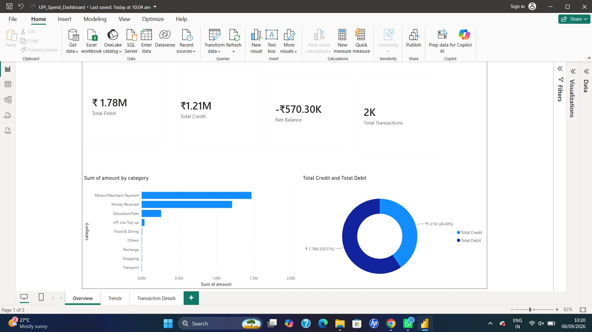
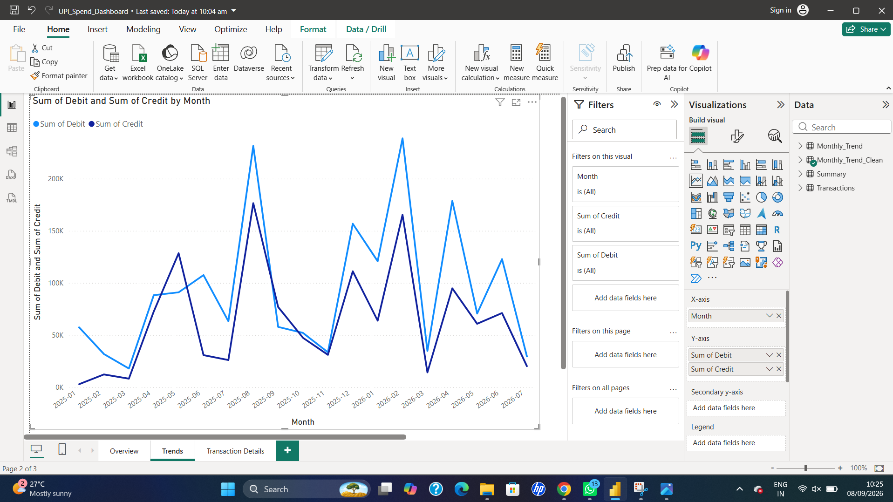
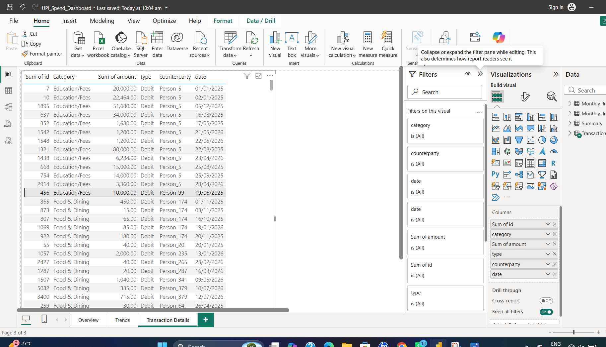

# 💸 UPI Spend Insights

**End-to-end data analysis project** exploring personal UPI (Unified Payments Interface) transaction data — from raw data extraction to an interactive Power BI dashboard.

Built using **Python, SQL, Excel, and Power BI** to demonstrate a complete real-world data analytics workflow: extract → clean → store → analyze → visualize.

---

## 📌 Project Overview

This project analyzes anonymized personal UPI transaction data to uncover spending patterns, track income vs expenses, and surface trends over time. It walks through the full data analytics pipeline that a data analyst would typically use on real transactional data:

1. **Data Extraction & Cleaning (Python)** — parsed and anonymized raw UPI transaction data
2. **Data Storage & Querying (SQL)** — loaded data into MySQL and wrote analysis queries
3. **Exploratory Analysis (Excel)** — built formulas, pivot tables, and charts for quick insights
4. **Interactive Dashboard (Power BI)** — created a 3-page dashboard for visual, drill-down analysis

---

## 🛠️ Tools & Technologies

| Tool | Purpose |
|------|---------|
| **Python** | Data extraction, cleaning, and anonymization |
| **MySQL** | Data storage and SQL-based analysis |
| **Excel** | Pivot tables, formulas, and quick-view charts |
| **Power BI** | Interactive dashboard and data visualization |
| **GitHub** | Version control and project showcase |

---

## 📊 Power BI Dashboard

The dashboard has **3 pages**, each focused on a different angle of the transaction data.

### 1️⃣ Overview
KPI cards for Total Debit, Total Credit, Net Balance, and Total Transactions, alongside a category-wise spending breakdown and a Debit vs Credit split.



### 2️⃣ Trends
A monthly line chart comparing Credit vs Debit over time, helping identify spending and income patterns month over month.



### 3️⃣ Transaction Details
A detailed, filterable table of every transaction — including ID, date, category, amount, type, and counterparty — for granular drill-down.



---

## 🔍 Key Insights

- **Person-to-person payments** and **money received** make up the largest share of transaction volume by category.
- Debits (₹1.78M) significantly outweigh credits (₹1.21M), resulting in a negative net balance over the analyzed period.
- Roughly **2,000 transactions** were analyzed in total across all categories.
- Monthly trends reveal fluctuations in spending vs income, useful for identifying high-spend months.

---

## 📁 Repository Structure

```
upi-spend-insights/
│
├── data/processed/           # Cleaned & anonymized transaction dataset
├── scripts/                  # Python extraction & anonymization scripts, SQL loading script
├── sql/                      # SQL analysis queries
├── excel/                    # Excel dashboard with formulas, pivot tables, and charts
├── images/                   # Power BI dashboard screenshots (used in this README)
├── UPI_Spend_Dashboard.pbix  # Power BI dashboard file
└── README.md
```

---

## 🚀 How This Project Was Built

1. **Extracted** raw UPI transaction data and anonymized sensitive details using Python
2. **Loaded** the cleaned data into a MySQL database
3. **Queried** the data with SQL to answer specific analysis questions (spend by category, monthly totals, etc.)
4. **Explored** the data further in Excel using pivot tables and formulas
5. **Visualized** the full dataset in Power BI with an interactive, multi-page dashboard

---

## 👤 About Me

**Ramya Naik**
Aspiring Data Analyst | Python · SQL · Excel · Power BI

Feel free to explore the code, dashboard, and queries in this repo!
